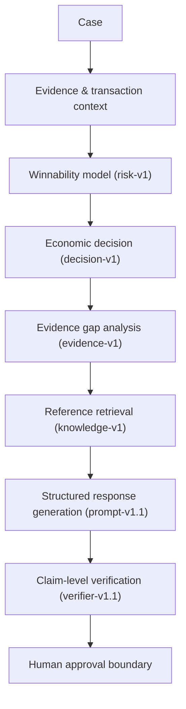
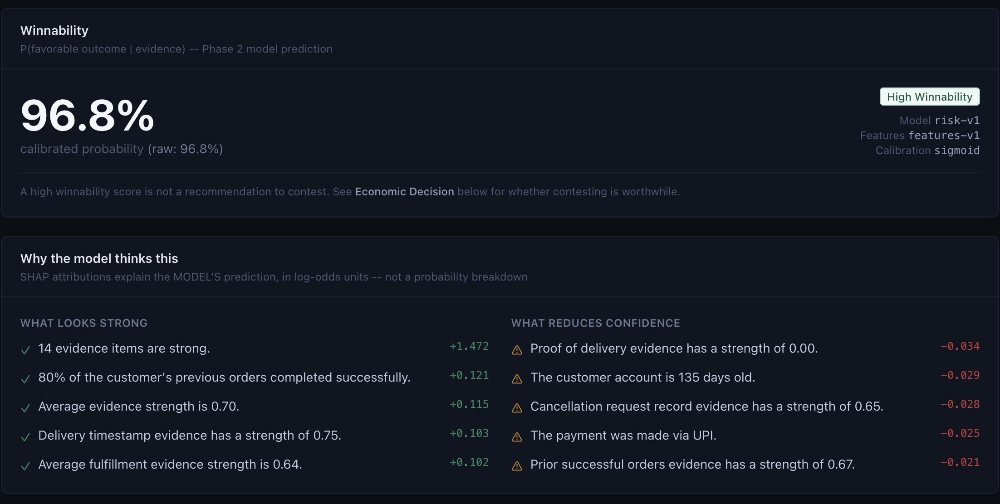
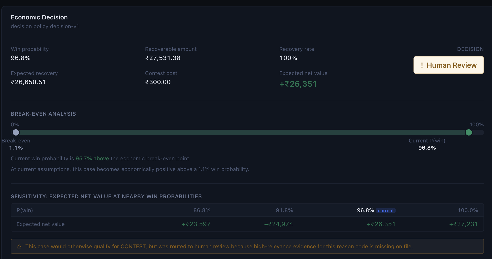
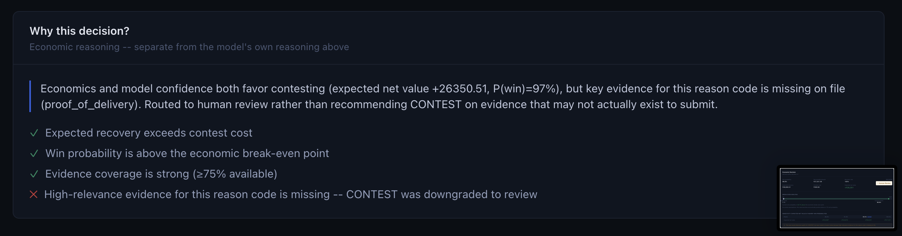
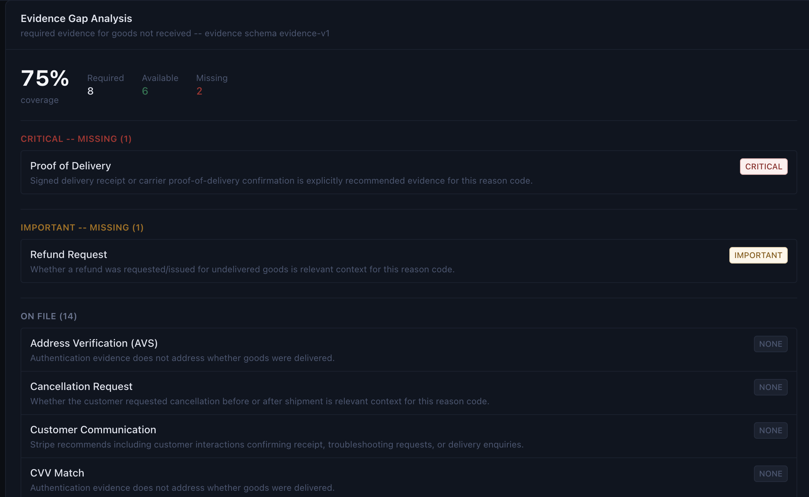
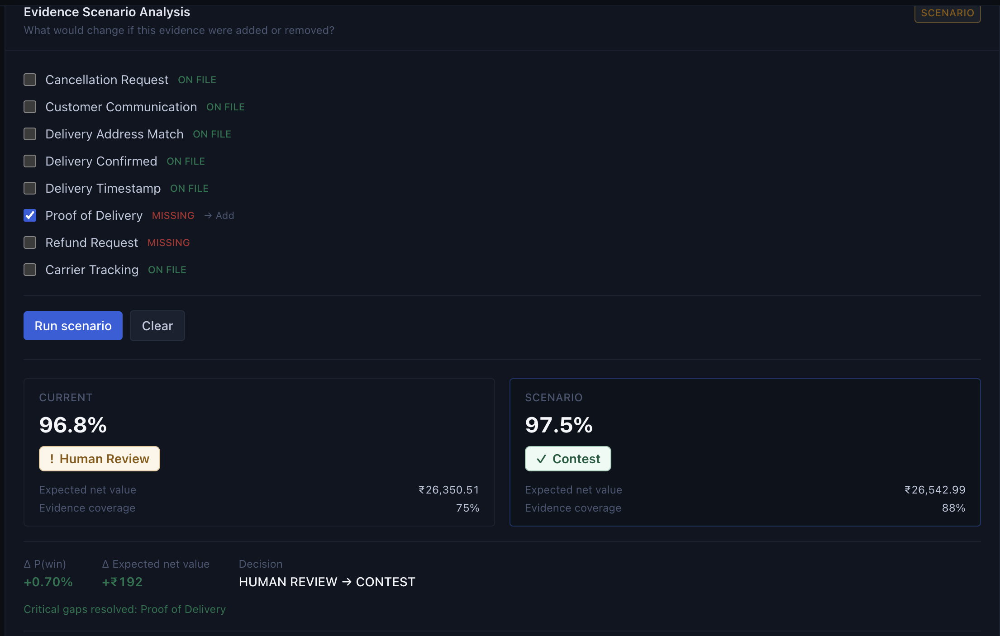
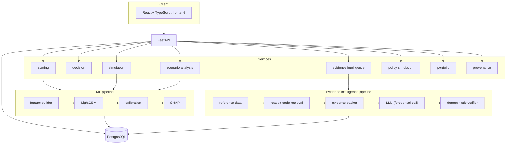

# DisputeWise

**AI-powered chargeback intelligence and evidence optimization.**


> Merchants don't have a chargeback-response problem. They have a decision problem.

DisputeWise predicts whether a dispute is worth contesting, explains why, identifies what evidence is missing, estimates the economic value of contesting, and — only when a draft response's claims can be independently verified against the case's own evidence — produces a grounded response for a human to review. It never submits anything on its own.

---

## 1. The problem

Chargebacks are expensive to fight and expensive to ignore. Evidence for a dispute is scattered across authentication logs, fulfillment records, and customer history, and merchants routinely make one of two mistakes: contesting cases that have no realistic chance of winning (wasted operational cost), or not contesting cases that would have won because assembling evidence felt like too much work.

A model that just predicts "will this dispute succeed" doesn't solve the problem either — a high win probability doesn't mean contesting is worth the cost, and a plausible-sounding AI-drafted response is worthless (or dangerous) if it cites evidence that doesn't exist. Any system that touches this workflow needs three things at once: **decision support** (is this worth pursuing, economically), **evidence intelligence** (what do we have, what's missing, what does policy require), and **verification** (does every sentence of a generated response actually trace back to something real). DisputeWise is built around the belief that skipping any of the three makes the other two unsafe to use.

## 2. What DisputeWise does



**Winnability model.** A LightGBM classifier scores `P(favorable outcome | evidence)` from 94 leakage-safe features, calibrated with Platt scaling, explained per-case with exact TreeSHAP contributions. It says nothing about whether to contest — that's a separate, deliberately non-ML decision.

**Economic decision.** Combines the calibrated probability with the dispute amount, an assumed recovery rate, and a contest cost to compute expected recovery and expected net value, then routes the case to `CONTEST`, `HUMAN_REVIEW`, or `DO_NOT_CONTEST`. A case with strong evidence and clearly positive economics can still be routed to `HUMAN_REVIEW` — the evidence gate below is the reason why.

**Evidence gap analysis.** Reads the case's reason code and its evidence rows against reference requirements (never per-case hardcoded rules) and reports exactly what's required, what's on file, and what's critically missing. If a `CONTEST`-eligible case is missing high-relevance evidence for its reason code, the gate downgrades it to `HUMAN_REVIEW` — regardless of how confident the model is.

**Reference retrieval.** A small TF-IDF retriever over a 51-chunk knowledge base built from public reason-code/evidence documentation (`data/reference/`) — no vector database or embedding model, because the corpus doesn't need one. Retrieval is filtered by reason code and biased toward chunks that address the case's actual evidence gaps.

**Structured response generation.** An LLM is called through a forced tool-call contract — it can only emit a JSON object matching a strict schema, never free-text prose. The schema is validated with Pydantic before anything downstream touches it.

**Claim-level verification.** Every claim in a generated draft is independently checked, deterministically, against the case's own evidence, cited source IDs, and allowed field values. One unverifiable claim blocks the entire draft — a majority of good claims never outvotes a single bad one.

**Human approval boundary.** The pipeline stops here. Nothing is submitted to a card network, no customer is contacted, and no dispute status changes automatically — always.

## 3. The product

Everything below is one connected application over the same case data and the same pipeline above — not separate disconnected demos.

| Surface | What it's for |
|---|---|
| **Dispute inbox** | Browse, filter, and search real cases |
| **Case investigation** | Open one case: winnability, SHAP factors, evidence inventory |
| **Decision workspace** | Expected recovery/net value, break-even and sensitivity analysis, the routing explanation |
| **Evidence workspace** | Gap analysis against reason-code requirements, the evidence packet, retrieved reference guidance |
| **AI response workspace** | Generate a grounded draft, inspect every claim's verification result |
| **Audit / provenance** | The full stage-by-stage trace for one case — versions, sources, states |
| **New dispute simulation** | Score a hypothetical dispute through the real pipeline — never persisted |
| **Evidence scenario analysis** | "What if this evidence were added or removed?" for a real case — never persisted, never mutates the case |
| **Policy playground** | Explore hypothetical contest-cost/threshold economics against real portfolio data — never mutates the production policy |
| **Portfolio risk view** | Aggregate routing, amount at risk, and coverage across the dataset |

**Screenshots** — case overview with SHAP factors, the economic decision breakdown, the decision explanation, evidence gap analysis, and evidence scenario analysis (the exact DSP-031597 example above, live):

<p>
  
  
</p>
<p>
  
  
</p>
<p>
  
</p>

## 4. Why this is different

Most "AI writes a dispute response" projects stop at generation. DisputeWise treats generation as the last, least-trusted step in a longer decision pipeline.

| | Generic LLM dispute-writer | DisputeWise |
|---|---|---|
| Decides whether to act first | No — writes on request | Yes — economic decision precedes generation |
| Economic reasoning | None | Expected recovery/net value, explicit cost assumptions |
| Evidence-aware routing | None | High-confidence cases can still be gated to human review on missing evidence |
| Grounding | Prompt-only, hope | Retrieval biased toward the case's actual gaps |
| Claim verification | None, or LLM self-grading | Deterministic, independent, claim-by-claim |
| Failure mode | Fabricates fluently | Blocks the draft and says why |
| Human boundary | Often implicit | Explicit, structural — no submission path exists |
| Evaluation | Vibes | Locked held-out test set, checksum-guarded, reproducible |
| Leakage protection | Rarely addressed | Target unreachable by construction, audited |
| What-if analysis | None | Simulation, evidence scenarios, and policy sensitivity, all read-only |
| Explainability | None or post-hoc | SHAP + a full provenance trail per case |

## 5. Architecture



A modular monolith, not microservices: one FastAPI application, one Postgres database, service modules with clear boundaries (`app/services/*`) rather than network calls between them. Everything runs under Docker Compose.

Deeper technical detail: [docs/architecture.md](docs/architecture.md).

## 6. Model + evaluation

Locked held-out test set, n = 7,446, evaluated **once**, calibrated:

| Metric | Value |
|---|---|
| ROC-AUC | **0.8990** |
| PR-AUC | **0.9334** |
| Precision | 0.8589 |
| Recall | 0.8705 |
| F1 | 0.8647 |
| Brier | 0.1217 |
| ECE | 0.0122 |
| FPR | 0.2333 |
| FNR | 0.1295 |

Confusion matrix @ threshold 0.44 (selected on validation, never on test): TP 4,019 · TN 2,169 · FP 660 · FN 598.

Against the strongest of three evidence-completeness baselines (ROC-AUC 0.7579, F1 0.7715, Brier 0.2094): **+0.1412 ROC-AUC, +0.0932 F1, −0.0877 Brier**.

**The test set was locked before model evaluation and was not used for threshold or policy tuning.** `data/locked/test/` is generated once, checksummed, and every official evaluation script re-verifies that checksum before and after running. The split is customer-level (not case-level), so no customer's cases straddle train/validation/test. `build_features()` structurally cannot see the outcomes table — leakage is prevented by the function signature, not by remembering to drop a column — and `recovery_amount` was audited and excluded as a near-perfect target proxy.

Full methodology, baselines, and the exact reproduction commands: [docs/evaluation.md](docs/evaluation.md) and [docs/phase2.md](docs/phase2.md).

## 7. Decision engine

```
expected recovery = P(win) × recoverable amount
expected net value = expected recovery − contest cost
```

A case becomes **CONTEST** when expected net value clears a minimum by more than a review margin *and* the model is confident; **DO_NOT_CONTEST** under the mirror condition; everything else — including every case near the economic boundary — is **HUMAN_REVIEW**.

**Evidence gate**, applied separately from the economics: a `CONTEST`-eligible case with missing high-relevance evidence for its reason code is downgraded to `HUMAN_REVIEW`. This is the one place evidence completeness overrides the model's own confidence, and it only ever moves in that direction.

`contest_cost=₹300` and `recovery_rate=1.0` are **prototype assumptions**, not verified production economics. That assumption has a real, visible consequence on the validation split: at ₹300, a naive "contest everything" baseline realizes **₹10.35M** vs the policy's **₹5.40M**, because filing costs so little relative to typical dispute value that even the 16.6%-favorable `DO_NOT_CONTEST` bucket is worth pursuing. Raise the assumed cost to ₹5,000 and it inverts sharply: contest-everything collapses to **−₹24.6M** while the policy holds its **+₹5.40M**. The model separates the buckets cleanly either way (91.2% vs 16.6% favorable) — what changes is whether the cost assumption makes routing worth doing. The [policy playground](#3-the-product) makes this sensitivity explorable directly.

## 8. Evidence intelligence

Evidence requirements are **reason-code-specific and reference-driven** — read from `data/reference/` per reason code, never hardcoded per case. For `goods_not_received`, delivery confirmation and proof of delivery matter; for `unauthorized_transaction`, authentication signals matter; for `duplicate_charge`, transaction/order history matters. The same gap analyzer produces the coverage numbers behind the evidence gate above, the evidence packet handed to generation, and the retrieval query.

The **evidence packet** is the narrow, LLM-safe view of a case: it structurally excludes raw PII and every outcome/target field — there is no `favorable_outcome` or `recovery_amount` anywhere in its schema to leak.

Retrieval runs against `knowledge-v1` — 51 deterministic chunks built from the same reference data, TF-IDF ranked, filtered by reason code, and biased toward chunks that address the case's actual gaps.

## 9. AI safety / grounding

**The LLM does not decide whether a claim is true.** It produces a structured draft under a forced tool-call contract; a separate, deterministic verifier then checks every claim independently.

A claim must trace to real case evidence, an allowed case field, or retrieved reference material — never to something invented. Any claim that fails is `UNSUPPORTED` or `INVALID_REFERENCE`, and **a single such claim blocks the entire response**, regardless of how many other claims are fine. Every hallucination scenario in the adversarial test suite — a fabricated delivery date, evidence claimed present that isn't, cross-case evidence contamination, a nonexistent evidence ID, guaranteed-win language, a fabricated policy citation — passes: **13/13**.

The provider is pinned to a specific free OpenRouter model (`nvidia/nemotron-3-super-120b-a12b:free`), never a routing alias, so a demo run can never silently land on a different model. There is no retry loop, no LLM self-grading, and no fallback that parses free-text as if it were validated structured output.

**No automatic dispute submission. No customer-facing autonomous action. No external side effects, ever.** This is structural — there is no code path from a draft to an outbound submission.

## 10. Simulation + what-if analysis

- **New dispute simulation** — score a fully hypothetical case through the exact pipeline a real case uses. Nothing is persisted.
- **Evidence scenario analysis** — add or remove hypothetical evidence on a real, stored case and compare the current and hypothetical score/decision/gap side by side. The stored case is never mutated.
- **Policy playground** — explore hypothetical contest-cost and threshold economics against real portfolio data. The production decision policy is never modified.

**None of this is causal inference.** A scenario result is two model evaluations under two different inputs, not an estimate of what obtaining a piece of evidence would cause in the real world — both the API responses and the UI say so explicitly.

## 11. Portfolio + provenance

The **portfolio risk view** aggregates the real dataset under the production policy: decision distribution, amount at risk per bucket, and breakdowns by reason code, probability band, and evidence completeness — computed server-side, never by pulling the full dataset into the browser.

The **provenance trail** renders, per case, the exact chain of versions that produced its result — model, feature schema, decision policy, evidence schema, knowledge base, retrieval config, prompt, response schema, verifier — plus which sources were retrieved and how each claim was verified. **No chain-of-thought is ever stored or rendered**; a stage that did not run is shown as not run, never given a plausible-looking version it didn't actually report.

## 12. Data

```
data/
├── generated/    train/validation/test CSVs — reproducible, gitignored
├── locked/test/  the frozen held-out test set — committed, never regenerated in place
├── reference/    public-domain reason-code/evidence documentation — the RAG corpus source
├── external/     external benchmark data, kept separate — never merged into training
└── metadata/     lock checksum, generation summary, data manifest
```

50,000 synthetic chargeback cases (seed 42), split at the **customer** level: 35,115 train / 7,439 validation / 7,446 locked test. The locked test set's SHA-256 is `e1e8cd5054c92fd399c50fa733c0256ec05bea6c13c80a15165c7cd5d0693b5c`, re-verified by every official evaluation script before and after it runs.

The dataset is synthetic — **not real merchant data.** Public reference data (Stripe/Visa/Verifi documentation, with full provenance in `data/reference/sources.json`) grounds the generator's assumptions and is never treated as ML training data or a label source. Any external real-world data is kept in a separate directory and used only as an out-of-distribution check, never merged into training or evaluation.

Full rationale: [docs/data_strategy.md](docs/data_strategy.md) and [docs/external_data.md](docs/external_data.md).

## 13. Quick start

Requires Docker and Docker Compose.

```bash
git clone <this-repo>
cd disputewise

cp .env.example .env
docker compose up -d --build
```

That starts Postgres and the FastAPI backend and runs migrations automatically. The dataset needs generating and loading once per checkout:

```bash
docker compose run --rm backend python /scripts/generate_dataset.py --seed 42 --n-cases 50000
docker compose run --rm backend python /scripts/generate_dataset.py --seed 42 --n-cases 50000 --lock
docker compose run --rm backend python /scripts/load_database.py --splits train validation test
```

(A `Makefile` wraps all of this: `make up`, `make generate`, `make lock`, `make load-all`.)

Then run the frontend separately:

```bash
cd frontend
npm install
npm run dev
```

| | URL |
|---|---|
| Frontend | http://localhost:5173 |
| Backend API | http://localhost:8001 |
| Interactive API docs | http://localhost:8001/docs |
| PostgreSQL | `localhost:5433` (mapped from the container's 5432, to avoid clashing with other local Postgres instances) |

Response generation (`POST /cases/{id}/draft`) works fully without any key configured — it returns `GENERATION_UNAVAILABLE` (HTTP 200, decision/evidence/retrieval still fully populated) rather than an error. To enable live generation, get a free key at [openrouter.ai/settings/keys](https://openrouter.ai/settings/keys) and set `OPENROUTER_API_KEY` in `.env`.

Run tests:

```bash
docker compose run --rm backend pytest -q
cd frontend && npx vitest run
```

## 14. API

All endpoints below exist in the running application (verified against the live OpenAPI schema).

| Method | Path | Purpose |
|---|---|---|
| GET | `/health` | Liveness check |
| GET | `/cases` | List/filter/paginate cases |
| GET | `/cases/{id}` | Case, transaction, and customer detail |
| GET | `/cases/{id}/evidence` | Raw evidence rows for a case |
| POST | `/cases/{id}/score` | Calibrated winnability + SHAP factors |
| POST | `/cases/{id}/decision` | CONTEST / HUMAN_REVIEW / DO_NOT_CONTEST + economics |
| POST | `/cases/{id}/evidence-gap` | Required vs. available evidence for this case's reason code |
| POST | `/cases/{id}/evidence-packet` | The structured, LLM-safe evidence view |
| POST | `/cases/{id}/draft` | Grounded response generation + verification |
| POST | `/cases/{id}/verify` | Independently verify a set of claims |
| POST | `/cases/{id}/evidence-scenario` | Evidence what-if analysis for a real case |
| POST | `/simulate` | Score a fully hypothetical dispute |
| GET | `/policy/default` | The production decision policy's parameters |
| POST | `/policy/simulate` | Re-route the portfolio under a hypothetical policy |
| GET | `/portfolio/summary` | Server-side portfolio aggregation |

Full request/response schemas are in the interactive docs at `/docs` once the backend is running.

## 15. Testing

Run the full backend suite:

```bash
docker compose run --rm backend pytest -q
```

Covers: API contract tests per endpoint, ML feature determinism and target-leakage guards, customer-level split integrity, locked-dataset checksum verification, the evidence gap analyzer and retriever, the deterministic claim verifier (including the full adversarial hallucination suite), simulation and evidence-scenario no-persistence guarantees, policy-playground isolation from the production config, and portfolio aggregation correctness.

Frontend:

```bash
cd frontend && npx vitest run
```

Test counts change as the project grows — run the commands above for the current numbers rather than trusting a number in this document.

## 16. Repository structure

```
disputewise/
├── backend/
│   ├── app/
│   │   ├── api/              FastAPI routers, one module per resource
│   │   ├── services/         orchestration: scoring, decision, evidence intel, simulation, scenario, policy, portfolio
│   │   ├── ml/                feature builder, model, calibration, SHAP
│   │   ├── decision/          decision policy + config
│   │   ├── evidence_intel/    gap analyzer, packet, retrieval, prompt, verifier, LLM provider
│   │   ├── simulation/        hypothetical-case and evidence-scenario builders
│   │   ├── models/            SQLAlchemy ORM models
│   │   └── schemas/           Pydantic request/response schemas
│   ├── alembic/               DB migrations
│   └── tests/
├── frontend/
│   └── src/
│       ├── api/                typed client, one module per resource
│       ├── components/         case/, simulation/, layout/, common/
│       ├── pages/               inbox, case workspace, simulation, portfolio, policy playground
│       └── hooks/
├── scripts/                    dataset generation, training, evaluation, verification
├── data/                       see §12
├── artifacts/                  reproducible model + evaluation artifacts
├── docs/                       engineering-depth documentation (see below)
└── docker-compose.yml
```

## 17. Limitations

- **Synthetic dataset.** All 50,000 cases are generated, not real merchant data. Metrics measure the model against a known generative process.
- **The 8-case evidence benchmark is a constructed benchmark**, not a real-world hallucination-rate estimate. 100% on it means 8/8 constructed scenarios behaved as specified — nothing more.
- **Contest cost (₹300) and recovery rate (1.0) are prototype assumptions**, not verified production economics (see §7's sensitivity finding).
- **Simulation evidence strength uses distribution midpoints**, not a random draw, because a simulation needs to be reproducible.
- **Simulation timestamps use a fixed anchor** — features consume only differences between timestamps, so this doesn't affect scoring.
- **Verifier date/guarantee checks are regex-based.** There is no NLI or semantic-entailment layer; checks are deterministic but pattern-based.
- **Scenario analysis is not causal inference** (§10).
- **Model performance varies substantially within archetypes** — the headline metrics are portfolio-level.
- **Free LLM endpoints are unreliable.** Generation can be unavailable at any moment; the product degrades safely and says so rather than showing a stale or fabricated draft. A second free model (Gemma) was evaluated and not adopted after repeated HTTP 429s from its provider — see [docs/phase8-llm-provider.md](docs/phase8-llm-provider.md).
- **No automatic evidence ingestion from a live merchant/payment system** — cases are read from the dataset already loaded into Postgres.

## 18. Roadmap

- Validation against a real or licensed anonymized merchant benchmark.
- A stronger semantic/NLI verification layer alongside the current deterministic checks.
- Production evidence ingestion from a live merchant platform.
- Richer, network- and processor-specific cost models (replacing the flat contest-cost assumption).
- A human-feedback loop that informs future threshold/policy choices.
- Production observability (structured logging, tracing) beyond what's needed for local development.

## 19. Security / defense-only

DisputeWise is **defense-only** by construction:

- No automatic dispute submission, to any network or processor.
- No autonomous action directed at a customer.
- No payment-network manipulation of any kind.
- No external side effects — every endpoint reads or computes; nothing calls out except the optional, explicitly-configured LLM provider.
- Human approval is a structural boundary (§9, §2), not a UI convention that could be skipped.

## 20. License

No license file is currently included in this repository. All rights reserved by default until one is added.

---

## Documentation

README = product overview. Engineering depth lives in `docs/`:

| Doc | Covers |
|---|---|
| [docs/architecture.md](docs/architecture.md) | System architecture, service boundaries, data flow |
| [docs/evaluation.md](docs/evaluation.md) | Evaluation methodology, splits, metrics, baselines, limitations |
| [docs/data_strategy.md](docs/data_strategy.md) | Why three data categories, and how they relate |
| [docs/external_data.md](docs/external_data.md) | What external datasets were investigated, and why none were merged in |
| [docs/phase1.md](docs/phase1.md) | Data generation methodology, schema, reproducibility |
| [docs/phase2.md](docs/phase2.md) | Feature engineering, leakage defenses, model, calibration, SHAP |
| [docs/phase3.md](docs/phase3.md) | Decision policy, economics, sensitivity analysis |
| [docs/phase4.md](docs/phase4.md) | Evidence intelligence, RAG, generation, the verifier |
| [docs/phase6.md](docs/phase6.md) | Simulation architecture |
| [docs/phase8-llm-provider.md](docs/phase8-llm-provider.md) | LLM provider evaluation and live-verified status |
| [docs/frontend.md](docs/frontend.md) | Frontend setup, routing, manual testing walkthrough |
