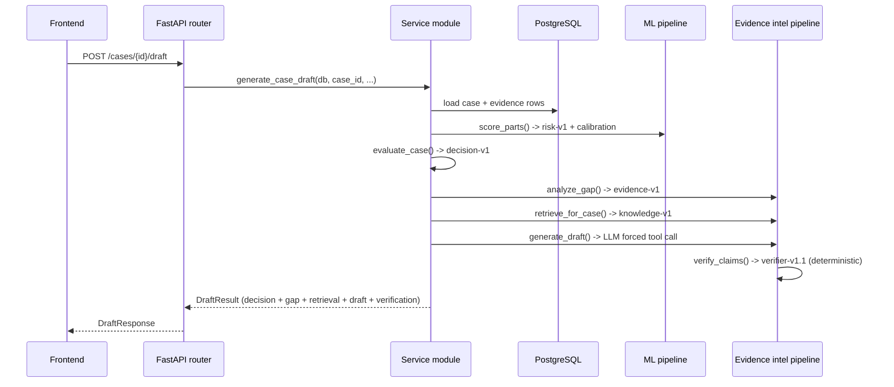

# Architecture

A modular monolith: one FastAPI application, one PostgreSQL database, and a React SPA. Module boundaries are enforced by convention and code review, not network calls — there is no service mesh, no message queue, and no microservice deployment story here. That's a deliberate choice for a system of this size, not an oversight.

## Request flow



Every stage above is a plain Python function call within one process. A request for `/draft` never crosses a network boundary except to Postgres (read) and, if configured, the LLM provider (the one genuinely external call in the entire system).

## Layout

```
backend/app/
├── api/            FastAPI routers -- one module per resource, thin: parse request,
│                   call a service, shape the response. No business logic lives here.
├── services/       orchestration layer. Each service composes calls into ml/, decision/,
│                   and evidence_intel/ -- it does not reimplement what they do.
│     scoring_service.py        Phase 2 entrypoint: score_case() (DB) / score_parts() (pure)
│     decision_service.py       Phase 3 entrypoint: decide_case()
│     evidence_intel_service.py Phase 4 entrypoint: generate_case_draft(), get_case_gap()
│     simulation_service.py     Phase 6: run_simulation() -- no Session parameter
│     scenario_service.py       Phase 7A: run_evidence_scenario() -- read-only on stored cases
│     policy_service.py         Phase 7B: compare_policies() -- throwaway DecisionConfig
│     portfolio_service.py      Phase 7C: score_portfolio() -- one scored split, cached
├── ml/             feature builder, LightGBM model wrapper, calibration, SHAP explainer
├── decision/       DecisionConfig (env-overridable), the policy function, evaluation helpers
├── evidence_intel/ gap analyzer, evidence packet, retrieval, prompt, LLMProvider + OpenRouter
│                   implementation, the deterministic verifier
├── simulation/     case_builder.py (hypothetical case -> in-memory parts),
│                   scenario_builder.py (real case + hypothetical evidence changes ->
│                   detached in-memory parts)
├── models/         SQLAlchemy ORM: Customer, Transaction, Dispute, Evidence, Outcome
└── schemas/        Pydantic request/response models, one module per API surface
```

## Key design decisions

**One feature builder, every caller.** `app/ml/features.py`'s `build_features()` is the only place features are computed, for real cases, simulated cases, and evidence scenarios alike. `score_parts()` in `scoring_service.py` is the one scoring entrypoint that works on in-memory case parts rather than a database row; `score_case()` is `score_parts()` plus a DB load. Simulation and scenario analysis call `score_parts()` directly — there is no second, parallel scoring implementation anywhere.

**No target ever reaches the feature builder.** `build_features(disputes, transactions, customers, evidence)` has no `outcomes` parameter — the target and its known proxy (`recovery_amount`) are structurally unreachable, not just conventionally excluded. Every request schema that could plausibly be misused to smuggle in an outcome (`SimulationRequest`, `EvidenceScenarioRequest`) is `extra="forbid"` and additionally rejects every name in `app/ml/schema.py`'s `FORBIDDEN_COLUMNS` by name, producing an explicit 422 rather than silently ignoring the field.

**Hypothetical case state never touches the ORM.** Simulation and scenario analysis both build a fully separate, frozen (`@dataclass(frozen=True)`) representation of a case (`SimEvidence`, `SimDispute`, etc. in `app/simulation/`), duck-typed to satisfy the same code the real pipeline uses. Neither service accepts a `Session`, so there is nothing to `commit()` even if a bug tried to. This is verified by tests that assert the service module imports no ORM model and compare table counts before/after a request.

**Decision policy is read-only outside the playground.** `get_decision_config()` is `lru_cache`d and returns the one production `DecisionConfig`. The policy playground builds a completely separate `DecisionConfig` instance from request overrides and hands it to the same `batch_decide()`/`summarize_buckets()` functions the offline evaluation scripts use — nothing about the decision math is duplicated between the playground, the API, and the scripts.

**Portfolio aggregation scores once, re-routes cheaply.** `portfolio_service.score_portfolio()` runs the feature builder and the model once per dataset split and caches the result (keyed by model version, so reloading a different model artifact can't serve stale probabilities). Both the policy playground and the portfolio view re-route that same cached scoring under different policies — re-routing 7,000+ cases is pure Python arithmetic, not model inference, so it's fast enough to be interactive.

**The frontend never recomputes a decision.** Every number the UI shows — a probability, an expected value, a routing decision, a verification status — is rendered from a backend response field. There is no client-side threshold comparison or expected-value formula anywhere in `frontend/src/`.

**CORS is avoided by proxying, not by modifying the backend.** The backend sends no CORS headers. Rather than add them, `frontend/vite.config.ts` proxies specific path prefixes (`/cases`, `/health`, `/simulate`, `/policy`, `/portfolio`) to the backend, so every browser request is same-origin. One consequence: the frontend's own page routes for these resources are named to avoid colliding with the proxy prefixes (`/case/:id` singular, `/simulation`, `/risk`, `/playground`) — see `docs/frontend.md` for the full rationale, which tripped up an earlier iteration in exactly the way you'd expect.

## Storage

PostgreSQL, five tables: `customers → transactions → disputes → {evidence, outcomes}`. `disputes` is the case table referenced throughout the API. Schema is managed with Alembic; migrations run automatically on container start. The `outcomes` table exists only for training/evaluation and retrospective portfolio reporting — no API endpoint that scores or decides a case ever reads it.

## Infrastructure

Docker Compose runs two services: `db` (Postgres 16) and `backend` (FastAPI, `uvicorn --reload`). The frontend is not containerized — it runs via `npm run dev` against the backend through the Vite proxy described above. Ports are chosen to avoid clashing with other local projects: backend on `8001` (mapped from the container's `8000`), Postgres on `5433` (mapped from `5432`).
